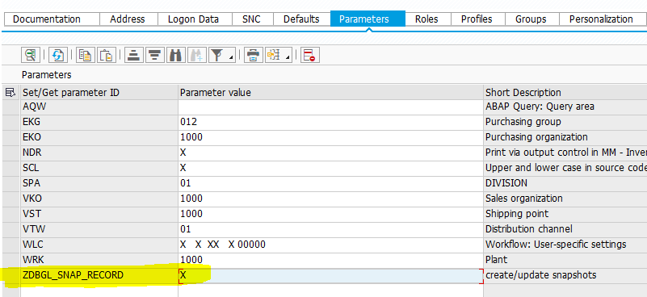
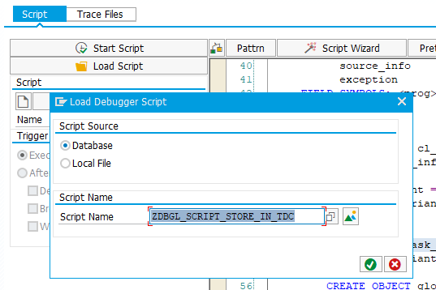

# Snapshots in ABAP #

## Snapshots ##
Create snapshots either in the debugger or directly in your unit-tests.
Snapshots are stored in ECATT test data containers (TDC).

## Unit-Test ##
Snapshots can be created with class ```zdbgl_snapshots_tdc```.
The following listing shows a sample unit-test using snapshots.
```ABAP
CLASS test_snapshot DEFINITION FOR TESTING
  DURATION SHORT RISK LEVEL HARMLESS.

  PRIVATE SECTION.

    METHODS flight_test FOR TESTING
      RAISING zcx_dbgl_snapshot.

ENDCLASS.

CLASS test_snapshot IMPLEMENTATION.

  METHOD flight_test.

    DATA(snapshot_manager) = zdbgl_snapshots_tdc=>create_default(
      tdc_name = 'ZDBGL_SNAPSHOT_SAMPLE'
    ).

    DATA(carrier) = VALUE scarr_tab(
      ( carrid = 'SAP' carrname = 'SAP Flights' )
      ( carrid = 'IN' carrname = 'Internat. Airways' )
    ).
    DATA(flight) = VALUE sflight( carrid = 'SAP' connid = 700 fldate = '20201231' ).

    snapshot_manager->compare_or_record( name = 'CARRIER' actual = carrier ).
    snapshot_manager->compare_or_record( name = 'FLIGHT' actual = flight ).

    " can be omitted, when autosave = abap_true in factory method or constructor
    snapshot_manager->commit_changes( ).

  ENDMETHOD.

ENDCLASS.
```
The method ```snapshot_manager->compare_or_record``` compares the given value with the recorded value or records the value. We need to give every value a unique name in the parameter ```name```.
The behavior (recording or comparing) is controlled with the SET/GET-parameter ```ZDBGL_SNAP_RECORD```.
A value of 'X' means 'create/update the snapshot'.


### Comparison ###
The standard implementation uses the method ```cl_abap_unit_assert=>assert_equals``` for comparison.
Override the method ```zdbgl_snapshots_tdc=>compare``` to specify another comparison method.

### Restrictions ###
* Structures must be defined in the ABAP dictionary. Structures defined outside of the ABAP dictionary can't be stored in test data containers.
* Any kind of references (pointing to classes, interfaces or data objects) are not supported
* Updating a snapshot closes the SAP-LUW with ```COMMIT WORK```. To avoid this, use debugger snapshots as described in the next section.

## Debugger ##
### Create snapshots ###
Another option to create snapshots is the debugger script ```zdbgl_script_store_in_tdc```.
Prerequisite is an existing TDC.

#### Prerequisite step: create ECATT test data container ####
Go the transaction ```secatt``` and create a test data container. Add a parameter for every variable you want to record. The parameter should have the same name and type as the variable.
Last but not least give the test data container API access as shown in the picture below.


#### Before the modification ####
Set an appropriate breakpoint and create the snapshot with the debugger-script ```zdbgl_script_store_in_tdc```.

This script asks you for the name, the version and the variant of the test data container as shown in the picture below.


### Writing unit-tests ###
With the API in the class ```cl_apl_ecatt_tdc_api``` we can access the snapshot.

### Example ###
The example can be found in the program ```zdbgl_demo_regression_test```.

The procedure ```to_verify``` is the procedure under test.
```ABAP
FORM to_verify.
  FIELD-SYMBOLS: <line> TYPE sflight.

  APPEND INITIAL LINE TO demo_itab ASSIGNING <line>.
  <line>-carrid = 'LH'.
  <line>-connid = '3444'.
  <line>-price = 400.

ENDFORM.
```

In the first step we create a snapshot before and after this procedure is executed.

In the second step we use the snapshot (test data container "ZDBGL_SAMPLE") to write unit-tests:
```ABAP
REPORT ZDBGL_DEMO_REGRESSION_TEST.
DATA: demo_itab TYPE STANDARD TABLE OF sflight.

START-OF-SELECTION.
  FIELD-SYMBOLS: <line> TYPE sflight.

  APPEND INITIAL LINE TO demo_itab ASSIGNING <line>.
  <line>-carrid = 'LH'.
  <line>-connid = '3445'.
  <line>-price = 500.
  BREAK-POINT. "snapshot is created
  PERFORM to_verify.
  BREAK-POINT. "snapshot is created


" subprogram should be verified.
" It changes the global variable demo_itab.
FORM to_verify.
  FIELD-SYMBOLS: <line> TYPE sflight.

  APPEND INITIAL LINE TO demo_itab ASSIGNING <line>.
  <line>-carrid = 'LH'.
  <line>-connid = '3444'.
  <line>-price = 400.

ENDFORM.

CLASS regression_test DEFINITION FOR TESTING
  DURATION SHORT RISK LEVEL HARMLESS.

  PRIVATE SECTION.
    DATA: tdc_accessor TYPE REF TO cl_apl_ecatt_tdc_api.

    METHODS setup
      RAISING cx_static_check.

    METHODS verify_changed_itab FOR TESTING
      RAISING cx_static_check.

ENDCLASS.

CLASS regression_test IMPLEMENTATION.

  METHOD setup.

    tdc_accessor = cl_apl_ecatt_tdc_api=>get_instance( EXPORTING
      i_testdatacontainer = 'ZDBGL_SAMPLE' i_testdatacontainer_version = 1 ).

  ENDMETHOD.

  METHOD verify_changed_itab.
    DATA: exp_demo_itab LIKE demo_itab.

    " given: use the snapshot before procedure under test was executed
    tdc_accessor->get_value( EXPORTING i_param_name = 'DEMO_ITAB' i_variant_name = 'BEFORE'
      CHANGING e_param_value = demo_itab ).

    " when: execute procedure under test
    PERFORM to_verify.

    " then: use the snapshot after the procedure under test was executed
    tdc_accessor->get_value( EXPORTING i_param_name = 'DEMO_ITAB' i_variant_name = 'AFTER'
      CHANGING e_param_value = exp_demo_itab ).
    cl_abap_unit_assert=>assert_equals( exp = exp_demo_itab
     act = demo_itab msg = 'Regression test not passed' ).

  ENDMETHOD.

ENDCLASS.
``` 

### Restrictions ###
These types are currently supported:
* simple types (like characters, strings, integer)
* flat structures (complex structures containing components with tables or structures are not supported)
* tables with a flat structure or a simple type as the table line type

These types are not supported:
* all form of references
* complex structures
* tables with complex structures as the table line type or with tables as the table line type

### Legacy API ###
There is a legacy API to create snapshots in the debugger, which uses the database tables ```zdbgl_variables``` and ```zdbgl_locals``` as a temporary storage and which is bit more difficult to use. This API is documented in the [docs-folder](docs/README_legacy_v0.md).

## Installation ##
Installation is done with [abapGit](https://github.com/larshp/abapgit). ABAP 7.40 or higher is needed.
All ABAP-objects have the prefix ```zdbgl```.

## Logs ##
Exceptions are logged in the checkpoint-groups "zdbgl_store_globals" and "zdbgl_store_locals" (see transaction ```saab```).
Logging is only active, if the checkpoint-groups is activated.
