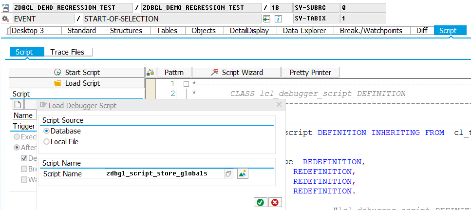
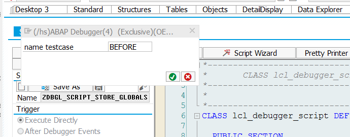
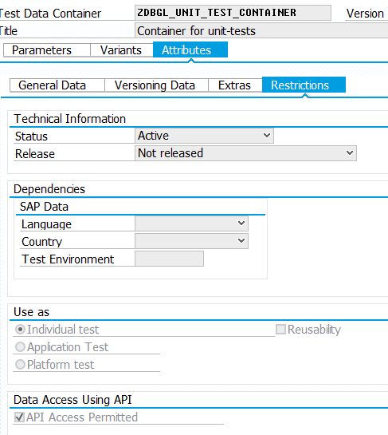
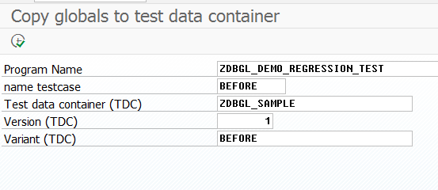
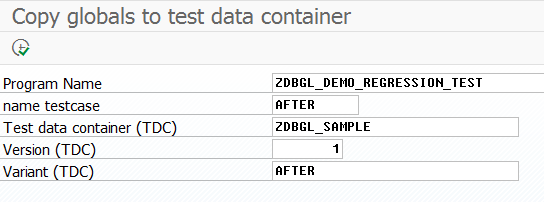
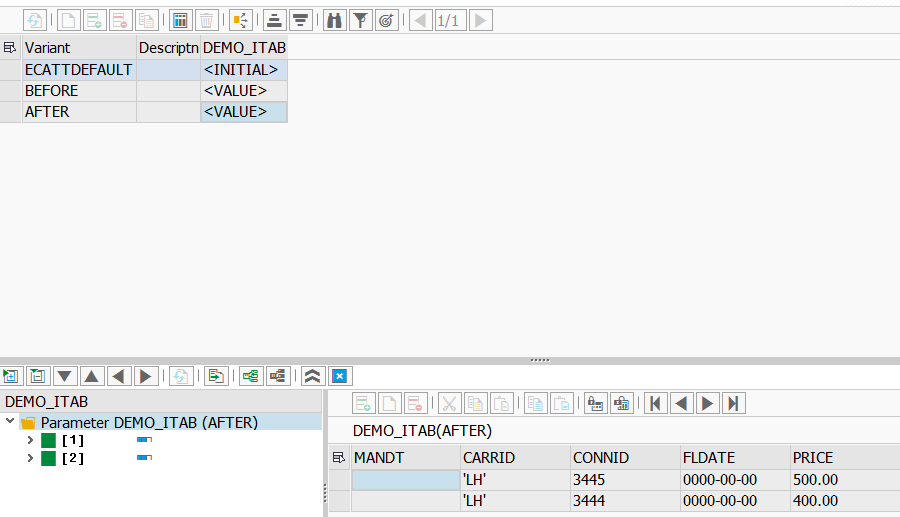

# Regression tests in ABAP #

## Idea ##
Regression tests are usable for comparing the results of a algorithm before and after a source-code modification.
Unit-tests are one way to execute regression tests.
A single unit-test-method can be splitted in the above sections:
```ABAP
CLASS unit_test DEFINITION DEFINITION FOR TESTING
  DURATION SHORT RISK LEVEL HARMLESS.

  PRIVATE SECTION.

    METHODS should_return_some_result FOR TESTING.

ENDCLASS.

CLASS unit_test IMPLEMENTATION.

  METHOD should_return_some_result.

    " given: prepare the input parameters

    " when: execute the procedure under test

    " then: verify the results

  ENDMETHOD.

ENDCLASS.

```
In legacy codes the ```given``` and the ```then``` sections contain assignments of huge structures or huge internal tables.
Adding unit-tests for legacy code can be time consuming, because we must determine values for huge structures and for huge internal tables.
The debugger-scripts in this repository can help you to determine these values more quickly, because they record values of global and local variables and store them permanent in the database.

## How to use it ##
### Regression test of a procedure ###
#### Before the modification ####
Set a breakpoint before the procedure is executed. Set a breakpoint after the procedure is finished.
Record the global or local variables at both breakpoints with the debugger script ```zdbgl_script_store_globals``` or the debugger script ```zdbgl_script_store_locals```.

Go to "Script" Tab in the debugger and load the script ```zdbgl_script_store_globals``` or the script ```zdbgl_script_store_locals``` from the database.


The script will prompt you to enter an Key for the testcase. For each record you should choose an unique id.


### Storage ###
The global variables are temporary stored in the table ```zdbgl_variables```. The column "globals" 
contains the hexadecimal values of the global variables in an json format.
The hexadecimal values are encoded in base 64. The locals are temporary stored in the table ```zdbgl_locals``` also encoded in base 64.

#### Copy to test data containers (ECATT) ####
The recorded values are temporary stored in base64-encoding (tables ```zdbgl_variables``` and ```zdbgl_locals```).
The temporary storage has same disadvantages:
1. If the system encoding is changed, the records are unuseable.
2. hexadecimal values aren't human-friendly.
3. The tables aren't connected to the transport-system. With the next system-copy, they get lost.

Test data containers (Transaction ```secatt```) don't come with these disadvantages. The idea was to copy the contents from the tables ```zdbgl_variables``` and ```zdbgl_locals``` to test data containers.
With the debugger API we don't have access to the technical type of the variables. Because of this reason the test data container needs to be created with the necessary variables, before we can copy the contents from the tables ```zdbgl_variables``` and ```zdbgl_locals``` to it. 
As shown in the picture below, API access should be permitted for the test data container.


The rule for copying is name equivalence.
The copy-API is located in class ```zdbgl_copy_to_tdc```. The report ```zdbgl_copy_globals_to_tdc``` copies global variables from table ```zdbgl_variables``` to the test data container (report ```zdbgl_copy_locals_to_tdc``` is for local variables).

### Writing unit-tests ###
With the API in class ```cl_apl_ecatt_tdc_api``` we can access the recorded values, which we copied in the step above to the test data container. The recorded values before the procedure is executed
can be used in the ```given``` section, the recorded values after the procedure is executed as expected results.

### Modification ###
Now we can modify the source-code and use the unit-tests from the last step as regression tests.

## Example ##
The example can be found in the program ```zdbgl_demo_regression_test```.

The procedure ```to_verify```, which can be found in its original form in the following listing is the procedure under regression test.
```ABAP
FORM to_verify.
  FIELD-SYMBOLS: <line> TYPE sflight.

  APPEND INITIAL LINE TO demo_itab ASSIGNING <line>.
  <line>-carrid = 'LH'.
  <line>-connid = '3444'.
  <line>-price = 400.

ENDFORM.
```

The regression test should verify, that the above implementation is equal to the following implementation:
```ABAP
FORM to_verify.
  
  INSERT VALUE #( carrid = 'LH' connid = '3444' price = 400 ) INTO TABLE demo_itab.

ENDFORM.
```
 
In the first step we record the globals (```demo_itab``` is a global variable) before the procedure ```to_verify``` is executed and after this procedure is executed with 
the debugger-script ```zdbgl_script_store_globals``` from this repository.
The record before the procedure is executed get's the key "BEFORE" and the record after the procedure is executed get's the key "AFTER".

In the second step we copy the recorded values to the test data container "ZDBGL_SAMPLE" with the report ```zdbgl_copy_globals_to_tdc``` as it can be seen in the pictures below.




In the third step we use the test data container "ZDBGL_SAMPLE" to write unit-tests:
```ABAP
REPORT ZDBGL_DEMO_REGRESSION_TEST.
DATA: demo_itab TYPE STANDARD TABLE OF sflight.

START-OF-SELECTION.
  FIELD-SYMBOLS: <line> TYPE sflight.

  APPEND INITIAL LINE TO demo_itab ASSIGNING <line>.
  <line>-carrid = 'LH'.
  <line>-connid = '3445'.
  <line>-price = 500.
  BREAK-POINT.
  PERFORM to_verify.
  BREAK-POINT.


" subprogram should be verified.
" It changes the global variable demo_itab.
FORM to_verify.
  FIELD-SYMBOLS: <line> TYPE sflight.

  APPEND INITIAL LINE TO demo_itab ASSIGNING <line>.
  <line>-carrid = 'LH'.
  <line>-connid = '3444'.
  <line>-price = 400.

ENDFORM.

CLASS regression_test DEFINITION FOR TESTING
  DURATION SHORT RISK LEVEL HARMLESS.

  PRIVATE SECTION.
    DATA: tdc_accessor TYPE REF TO cl_apl_ecatt_tdc_api.

    METHODS setup
      RAISING cx_static_check.

    METHODS verify_changed_itab FOR TESTING
      RAISING cx_static_check.

ENDCLASS.

CLASS regression_test IMPLEMENTATION.

  METHOD setup.

    tdc_accessor = cl_apl_ecatt_tdc_api=>get_instance( EXPORTING
      i_testdatacontainer = 'ZDBGL_SAMPLE' i_testdatacontainer_version = 1 ).

  ENDMETHOD.

  METHOD verify_changed_itab.
    DATA: exp_demo_itab LIKE demo_itab.

    " given: use the recorded values before the procedure under test was executed
    tdc_accessor->get_value( EXPORTING i_param_name = 'DEMO_ITAB' i_variant_name = 'BEFORE'
      CHANGING e_param_value = demo_itab ).

    " when: execute procedure under test
    PERFORM to_verify.

    " then: use the recorded values after the procedure under test was executed
    tdc_accessor->get_value( EXPORTING i_param_name = 'DEMO_ITAB' i_variant_name = 'AFTER'
      CHANGING e_param_value = exp_demo_itab ).
    cl_abap_unit_assert=>assert_equals( exp = exp_demo_itab
     act = demo_itab msg = 'Regression test not passed' ).

  ENDMETHOD.

ENDCLASS.
``` 

In the last step, we can modify the procedure ```to_verify``` and use the unit-test from above as verification.

### Recording locals ###
Local variables are recorded with the debugger script ```zdbgl_script_store_locals```.
It works the same way as recording globals.
The API for locals is located in the class ```zdbgl_get_locals``` and the values are stored in table ```zdbgl_locals```.

## Restrictions ##
These types are currently supported:
* simple types (like characters, strings, integer)
* flat structures (complex structures containing components with tables or structures are not supported)
* tables with a flat structure or a simple type as the table line type

These types are not supported:
* all form of references
* complex structures
* tables with complex structures as the table line type or with tables as the table line type


## Installation ##
Installation is done with [abapGit](https://github.com/larshp/abapgit). ABAP 7.40 or higher is needed.
All ABAP-objects have the prefix ```zdbgl```.

## Logs ##
Exceptions are logged in the checkpoint-groups "zdbgl_store_globals" and "zdbgl_store_locals" (see transaction ```saab```).
Logging is only active, if the checkpoint-groups is activated.
