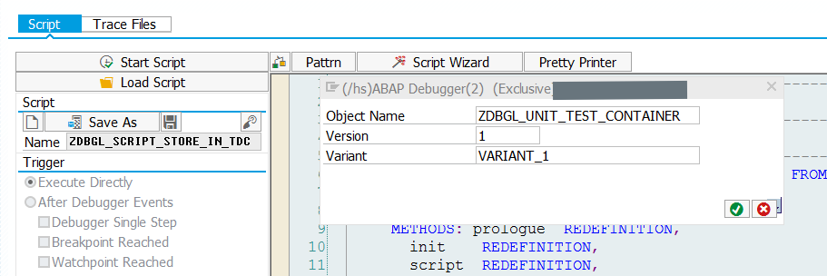

# Regression tests in ABAP #

## Idea ##
[Regression testing](https://en.wikipedia.org/wiki/Regression_testing) means to compare the results a piece of software is giving before and after changes were made to the source-code.

Unit-tests can be executed as regression tests.
But before they can be executed, values must be assigned to the input parameters, to the parameters of the test-doubles and to the expected results (test-data). This repository contains debugger-scripts, which record test-data shown in the debugger to ECATT test data containers.

## How to use it ##
### Regression test of a procedure ###
#### Create ECATT test data container ####
Go the transaction ```secatt``` and create a test data container. Add a parameter for every variable you want to record. The parameter should have the same name and type as the variable.
Last but not least give the test data container API access as shown in the picture below.


#### Before the modification ####
Set a breakpoint before the procedure under test is executed. Set a breakpoint after the procedure under test is finished. The debugger-script ```zdbgl_script_store_in_tdc``` copy the contents from the variable to the corresponding parameter of the test data container.
This script ask you for the name, the version and the variant of the test data container as shown in the picture below.

Execute this script a both breakpoints.

### Writing unit-tests ###
With the API in the class ```cl_apl_ecatt_tdc_api``` we can access the recorded values, which we copied in the step above to the test data container. The recorded values before the procedure is executed
can be used in the ```given``` section of the unit-test, the recorded values after the procedure is executed as expected results.

### Modification ###
Now we can modify the source-code and use the unit-tests from the last step as regression tests.

## Example ##
The example can be found in the program ```zdbgl_demo_regression_test```.

The procedure ```to_verify```, which can be found in its original form in the following listing is the procedure under regression test.
```ABAP
FORM to_verify.
  FIELD-SYMBOLS: <line> TYPE sflight.

  APPEND INITIAL LINE TO demo_itab ASSIGNING <line>.
  <line>-carrid = 'LH'.
  <line>-connid = '3444'.
  <line>-price = 400.

ENDFORM.
```

The regression test should verify, that the above implementation is equal to the following implementation:
```ABAP
FORM to_verify.
  
  INSERT VALUE #( carrid = 'LH' connid = '3444' price = 400 ) INTO TABLE demo_itab.

ENDFORM.
```

In the first step we record the globals (```demo_itab``` is a global variable) before the procedure ```to_verify``` is executed and after this procedure is executed with 
the debugger-script ```zdbgl_script_store_in_tdc```.

In the second step we use the test data container "ZDBGL_SAMPLE" to write unit-tests:
```ABAP
REPORT ZDBGL_DEMO_REGRESSION_TEST.
DATA: demo_itab TYPE STANDARD TABLE OF sflight.

START-OF-SELECTION.
  FIELD-SYMBOLS: <line> TYPE sflight.

  APPEND INITIAL LINE TO demo_itab ASSIGNING <line>.
  <line>-carrid = 'LH'.
  <line>-connid = '3445'.
  <line>-price = 500.
  BREAK-POINT.
  PERFORM to_verify.
  BREAK-POINT.


" subprogram should be verified.
" It changes the global variable demo_itab.
FORM to_verify.
  FIELD-SYMBOLS: <line> TYPE sflight.

  APPEND INITIAL LINE TO demo_itab ASSIGNING <line>.
  <line>-carrid = 'LH'.
  <line>-connid = '3444'.
  <line>-price = 400.

ENDFORM.

CLASS regression_test DEFINITION FOR TESTING
  DURATION SHORT RISK LEVEL HARMLESS.

  PRIVATE SECTION.
    DATA: tdc_accessor TYPE REF TO cl_apl_ecatt_tdc_api.

    METHODS setup
      RAISING cx_static_check.

    METHODS verify_changed_itab FOR TESTING
      RAISING cx_static_check.

ENDCLASS.

CLASS regression_test IMPLEMENTATION.

  METHOD setup.

    tdc_accessor = cl_apl_ecatt_tdc_api=>get_instance( EXPORTING
      i_testdatacontainer = 'ZDBGL_SAMPLE' i_testdatacontainer_version = 1 ).

  ENDMETHOD.

  METHOD verify_changed_itab.
    DATA: exp_demo_itab LIKE demo_itab.

    " given: use the recorded values before the procedure under test was executed
    tdc_accessor->get_value( EXPORTING i_param_name = 'DEMO_ITAB' i_variant_name = 'BEFORE'
      CHANGING e_param_value = demo_itab ).

    " when: execute procedure under test
    PERFORM to_verify.

    " then: use the recorded values after the procedure under test was executed
    tdc_accessor->get_value( EXPORTING i_param_name = 'DEMO_ITAB' i_variant_name = 'AFTER'
      CHANGING e_param_value = exp_demo_itab ).
    cl_abap_unit_assert=>assert_equals( exp = exp_demo_itab
     act = demo_itab msg = 'Regression test not passed' ).

  ENDMETHOD.

ENDCLASS.
``` 

In the last step, we can modify the procedure ```to_verify``` and use the unit-test from above as verification.

## Restrictions ##
These types are currently supported:
* simple types (like characters, strings, integer)
* flat structures (complex structures containing components with tables or structures are not supported)
* tables with a flat structure or a simple type as the table line type

These types are not supported:
* all form of references
* complex structures
* tables with complex structures as the table line type or with tables as the table line type

## Legacy API ##
There is a legacy API, which uses the database tables ```zdbgl_variables``` and ```zdbgl_locals``` as a temporary storage and which is bit more difficult to use. This API is documented in the [docs-folder](docs/README_legacy_v0.md).

## Installation ##
Installation is done with [abapGit](https://github.com/larshp/abapgit). ABAP 7.40 or higher is needed.
All ABAP-objects have the prefix ```zdbgl```.

## Logs ##
Exceptions are logged in the checkpoint-groups "zdbgl_store_globals" and "zdbgl_store_locals" (see transaction ```saab```).
Logging is only active, if the checkpoint-groups is activated.